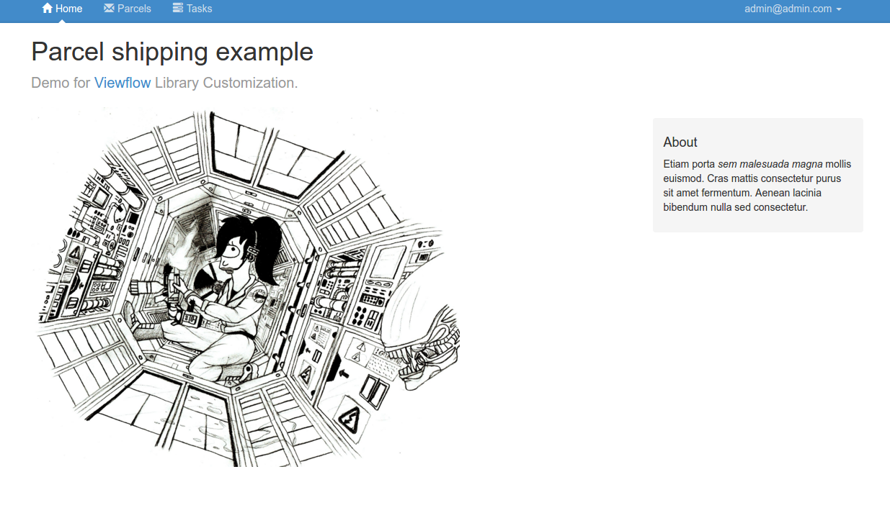
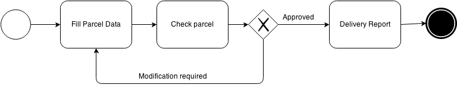

===========================
Viewflow customization demo
===========================

This recipe demonstrates customization and integration ability of the viewflow library

* Custom user model
* django-guardian object level permission
* Bootstrap3/No material.frontend
* Function based views for the flow

Run this sample with::

    tox python manage.py migrate
    tox python manage.py loaddata fixtures/default_data.json
    tox python manage.py runserver
